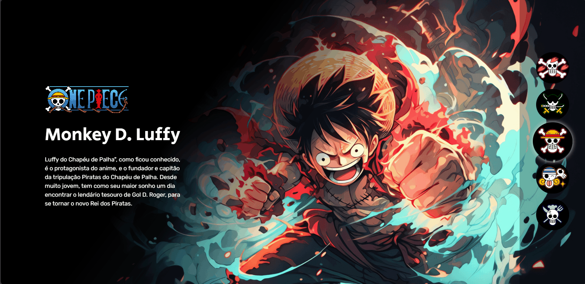
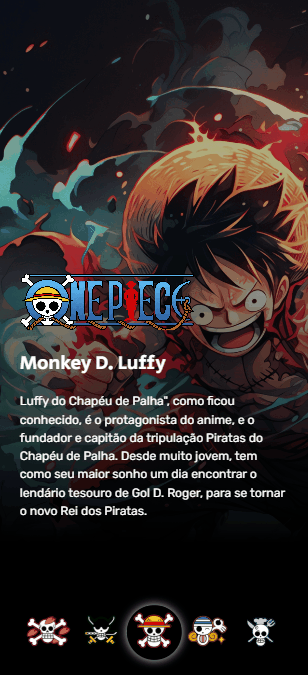

<h1 align="center">One Piece</h1>
 

### 🚨 Sobre o Projeto

Este projeto é um desafio proposto no curso que estou realizando para aprimorar meus conhecimentos em HTML, CSS e JavaScript. O objetivo é criar uma Landing Page inspirada no mundo épico de One Piece, e aqui, você poderá explorar alguns dos principais elementos da série enquanto eu aplico na prática os conceitos aprendidos no curso.

<strong>Link:<strong> https://joaonodari.github.io/onePiece/

### 🔨 Ferramentas Utilizadas

* [HTML](https://developer.mozilla.org/pt-BR/docs/Web/HTML)
* [CSS](https://developer.mozilla.org/pt-BR/docs/Web/CSS)
* [JSS](https://developer.mozilla.org/pt-BR/docs/Web/JavaScript)

### 📽️ Projeto 

    </img>
    
Landing page aberta no Desktop

 
 

    </img>
    
Landing page aberta no Mobile

